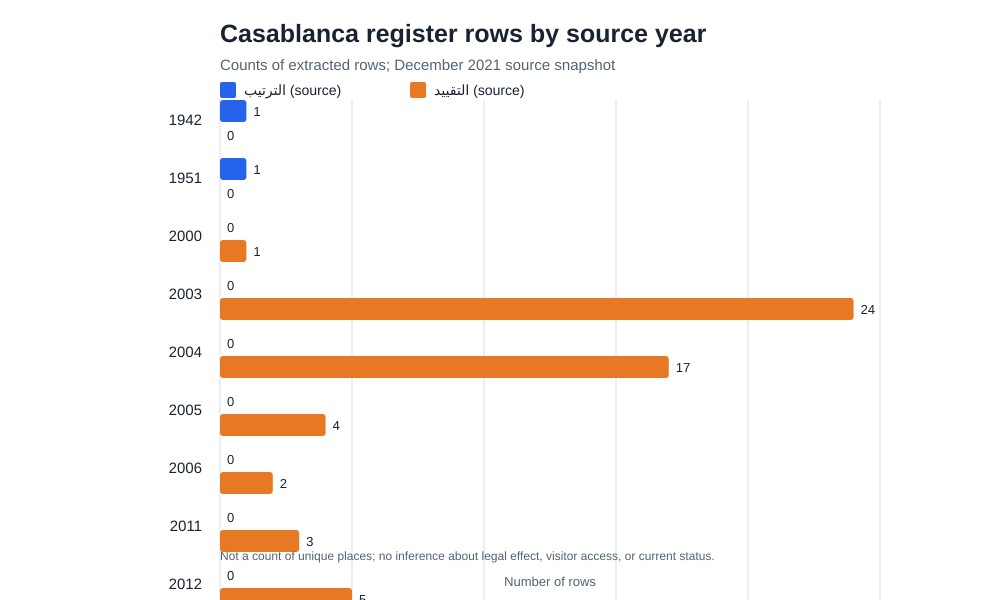

# Casablanca protected-heritage register (December 2021): 109 source rows

## Quick visual overview

Counts follow the source year and source-category labels. This is a row count from the December 2021 register, not a count of unique places or current legal status.

## Files

- [Download the CSV](data/casablanca-protected-heritage-register-2021-casablanca-109.csv) — 109 Casablanca rows extracted from the source register. Arabic source values are preserved.
- [Reproducible extractor](src/build_casablanca_heritage_csv.py) — requires Python 3, BeautifulSoup 4, and LibreOffice (`soffice`).
- Download the original Word document from the official source resource before reproducing; this repository does not mirror the source document.

## Provenance and scope

Prepared by Reda Rochd, who works with [MarocTours](https://maroctours.ru/), a commercial Casablanca tour operator. This is an independent open-data reuse, not an MJCC publication or endorsement; the dataset does not promote a tour. The author has no claim to heritage-law expertise.

- Publisher: Morocco's Ministry of Youth, Culture and Communication (MJCC).
- Dataset: « المواقع الأثرية و المباني التاريخية بجهة الدار البيضاء سطات » (archaeological sites and historic buildings in Casablanca-Settat).
- Source portal: <https://data.gov.ma/data/fr/dataset/3ae1adac-b0d4-4cdf-9e11-34c482534945>
- Source resource: <https://data.gov.ma/data/fr/dataset/3ae1adac-b0d4-4cdf-9e11-34c482534945/resource/913f28ef-3b82-48e7-b459-ccd1283c6e62>
- Reference date: December 2021, as stated in the register. This is not a current-status inventory.
- The portal lists the dataset under the Open Data Commons Open Database License (ODbL). This adapted extract retains that attribution and is released under ODbL as well. The extraction script is MIT-licensed (see `LICENSE-CODE.md`). The extracted data remains under ODbL. See <https://opendatacommons.org/licenses/odbl/1-0/>.

## Extraction and validation

The source is a Word document. The script converts it to HTML using LibreOffice so merged cells can be reconstructed, then extracts the first six tables, which contain the Casablanca entries in a consistent six-column structure. It preserves merged source values and keeps zero-based source table/row indexes for auditability. Summary rows and repeated headers are excluded.

The 109 output rows reconcile exactly with the source's own Casablanca totals: 2 rows marked `الترتيب` and 107 marked `التقييد`. No names or legal-category labels are translated or normalized. The categories' legal effects have not been independently interpreted.

## Counts by year as shown in the source

These are counts of extracted rows by the source column `السنة` (rendered in the CSV as `decision_year_as_published`). They are not independently verified dates of legal effect.

| Year in source | `الترتيب` rows | `التقييد` rows | Total rows |
|---:|---:|---:|---:|
| 1942 | 1 | 0 | 1 |
| 1951 | 1 | 0 | 1 |
| 2000 | 0 | 1 | 1 |
| 2003 | 0 | 24 | 24 |
| 2004 | 0 | 17 | 17 |
| 2005 | 0 | 4 | 4 |
| 2006 | 0 | 2 | 2 |
| 2011 | 0 | 3 | 3 |
| 2012 | 0 | 5 | 5 |
| 2013 | 0 | 5 | 5 |
| 2014 | 0 | 20 | 20 |
| 2015 | 0 | 5 | 5 |
| 2018 | 0 | 21 | 21 |
| **Total** | **2** | **107** | **109** |

## Limitations

This extract contains the source's names, protection-category labels, references, and years. It contains no coordinates, access information, condition survey, architectural classification, or confirmation that any place can be visited. Do not treat an entry as a unique tourist attraction or as proof of current legal status. Consult the cited decisions and current official sources for legal or access questions.
